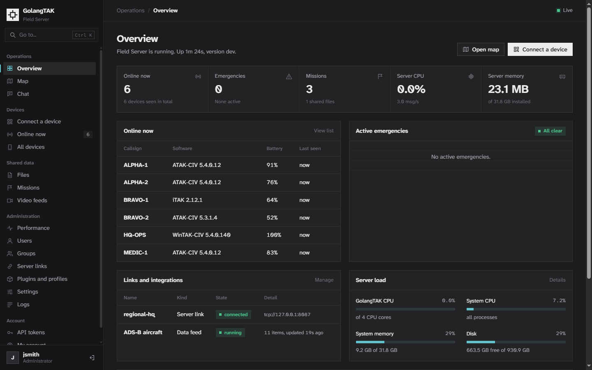
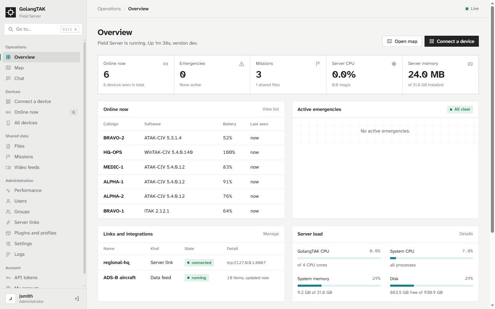
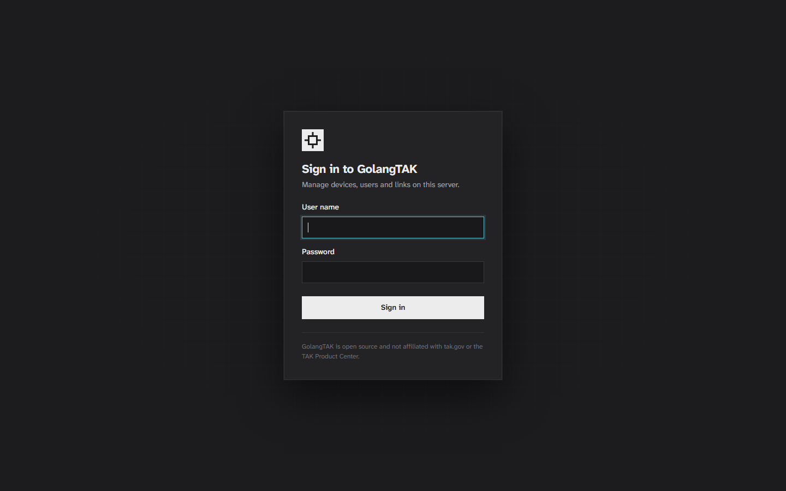
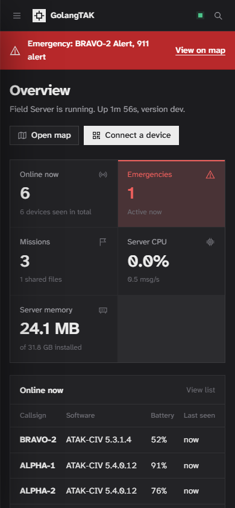

# GolangTAK

GolangTAK is a free, open source server for TAK clients such as ATAK, WinTAK, iTAK and TAK Aware, and for any other software that exchanges Cursor on Target (CoT) messages. It is a single program with no runtime dependencies, no containers and no database server. It runs on Linux, Windows, macOS, FreeBSD, OpenBSD, NetBSD, Raspberry Pi and other ARM boards, MIPS routers and cloud VPSs.

**GolangTAK is an independent open source project. It is not affiliated with, endorsed by, or associated with tak.gov, the TAK Product Center, or the makers of any TAK product.** Product names such as ATAK, WinTAK, iTAK, TAK Aware and TAK Server are used only to describe compatibility.



## Install

Paste one command for your system. It installs GolangTAK as a service that starts at boot and restarts itself if it ever stops, opens the firewall, creates the certificate authority and the first administrator account, and tests every port before it finishes.

**Linux, Raspberry Pi, cloud VPS, macOS**

```sh
curl -fsSL https://raw.githubusercontent.com/grangedevgroup-code/TAK-Backend/main/GolangTAK/scripts/install.sh | sh
```

**Linux without curl** (some minimal Debian and Ubuntu images)

```sh
wget -qO- https://raw.githubusercontent.com/grangedevgroup-code/TAK-Backend/main/GolangTAK/scripts/install.sh | sh
```

**FreeBSD**

```sh
fetch -qo - https://raw.githubusercontent.com/grangedevgroup-code/TAK-Backend/main/GolangTAK/scripts/install.sh | sh
```

**OpenBSD, NetBSD**

```sh
ftp -Vo - https://raw.githubusercontent.com/grangedevgroup-code/TAK-Backend/main/GolangTAK/scripts/install.sh | sh
```

**Windows** (PowerShell; it asks for administrator approval)

```powershell
irm https://raw.githubusercontent.com/grangedevgroup-code/TAK-Backend/main/GolangTAK/scripts/install.ps1 | iex
```

When it finishes, the installer prints the dashboard address, the administrator user name and password, and a QR code that iTAK can scan. Open the dashboard at `https://SERVER:8446` (or `http://SERVER:8080` on a trusted network) and sign in.

Lost the password? It stays in `admin-password.txt` until you change it:

```sh
sudo cat /var/lib/golangtak/admin-password.txt
```

```powershell
Get-Content C:ProgramDataGolangTAKadmin-password.txt
```

### Update, uninstall, other versions

| Task | Command |
| --- | --- |
| Update to the newest release | Run the install command again. Settings, users, certificates and data are kept. |
| Install a specific release | `curl -fsSL https://raw.githubusercontent.com/grangedevgroup-code/TAK-Backend/main/GolangTAK/scripts/install.sh | GOLANGTAK_VERSION=1.0.1 sh` |
| Set the address and name while installing | `curl -fsSL https://raw.githubusercontent.com/grangedevgroup-code/TAK-Backend/main/GolangTAK/scripts/install.sh | sh -s -- --address tak.example.org --name "Field Server"` |
| Remove GolangTAK, keep its data | `sudo golangtak uninstall` |
| Remove GolangTAK and all its data | `sudo golangtak uninstall --purge` |
| Install with Go instead of a download | `go install github.com/grangedevgroup-code/TAK-Backend/GolangTAK/cmd/golangtak@latest` then `sudo "$(go env GOPATH)/bin/golangtak" install` |
| Try it without installing | Download the binary from [releases](https://github.com/grangedevgroup-code/TAK-Backend/releases) and run `./golangtak` (or double-click `golangtak.exe`). It runs in that window until you press Ctrl+C. |

On Windows, run `golangtak` commands from an administrator PowerShell and leave out `sudo`.

### Installer options

Options after `sh -s --` (or arguments to `golangtak install`):

| Option | Effect |
| --- | --- |
| `--address HOST` | Address or DNS name devices use to reach the server (detected automatically if omitted) |
| `--name NAME` | Server name shown in clients |
| `--admin-password PW` | Password for the first administrator instead of a generated one |
| `--no-anonymous` | Require a certificate or password for every connection, and ignore UDP and multicast input |
| `--no-firewall` | Do not change firewall rules |
| `--no-start` | Install without starting |

Environment variables for the install scripts: `GOLANGTAK_VERSION=1.2.3` installs a specific release, `GOLANGTAK_SOURCE=1` builds from source with Go instead of downloading, and `GOLANGTAK_BINARY=/path/to/golangtak` installs a binary you already have.

### Everyday commands

| Task | Command |
| --- | --- |
| Is it running? | `sudo golangtak status` |
| Add a user | `sudo golangtak user add alice --groups Blue --callsign ALPHA-1` |
| Show QR codes to connect a device | `sudo golangtak qr alice` |
| Save a connection package | `sudo golangtak user package alice` |
| Follow the log | `sudo golangtak logs -f` |
| Restart | `sudo golangtak restart` |
| Test every port | `sudo golangtak selftest` |
| Back up | `sudo golangtak backup` |

The full list is under [Commands](#commands).

## Screenshots

| | |
| --- | --- |
|  |  |
| **Map**: team positions, markers, aircraft from the ADS-B feed and an active emergency | **Performance**: CPU, memory, disk and message rates over the last ten minutes |
|  |  |
| **Connect a device**: QR codes for ATAK, WinTAK and iTAK, packages and manual settings | **Settings**: grouped sections with a save bar that tracks unsaved changes |
|  |  |
| **Light theme**: follows the system setting, or choose it under My account | **Sign in** |

<p>

&nbsp;

</p>

The dashboard works on phones and tablets as well as desktops. Press Ctrl+K (or /) anywhere to jump to any page or setting.

## Connect devices

Open the dashboard and go to **Connect a device**:

- **ATAK and WinTAK enrollment QR code**: in ATAK choose Settings, Network, Servers, Add, Scan QR. The device enrolls for its own certificate with a one-time code.
- **iTAK quick connect QR code**: in iTAK choose Settings, Network, Servers, Connect with QR, then sign in with a user name and password.
- **Download link QR code**: a single-use link to a complete connection package.
- **Connection packages**: zip files to import on any TAK client, with a certificate, an enrollment profile, or plain TCP settings.
- **Manual setup**: address, ports, truststore and CA fingerprint for entering settings by hand.

The same is available from a terminal: `golangtak qr USER` prints enrollment QR codes and `golangtak user package USER` saves a connection package.

## Works with

| Software | How it connects |
| --- | --- |
| ATAK, ATAK-CIV, ATAK-MIL | SSL on 8089 with certificate enrollment, TCP on 8087, QR codes, connection packages, Data Sync, update server |
| WinTAK | SSL, TCP, connection packages, Data Sync |
| iTAK | SSL with quick connect QR and enrollment, TCP, server packages |
| TAK Aware and other CoT apps | SSL, TCP, UDP, connection packages |
| TAK Server | Federation version 1 and version 2 (gRPC) in both directions, including mission, file and log sharing over version 2, or a TCP or TLS link |
| OpenTAKServer, FreeTAKServer | TCP or TLS links in both directions; GolangTAK also serves the FreeTAKServer REST API on port 19023 |
| zyrntopo-tak-server and browser software | CoT over WebSocket on port 8090, links to WebSocket servers |
| Mesh and radio gateways | Multicast situational awareness (239.2.3.1:6969 and 224.10.10.1:17012), UDP input |
| Meshtastic | Gateway nodes connect to the built-in MQTT broker on port 1883 (when enabled), or both sides share an MQTT broker |
| Scripts and integrations | REST API with tokens, CoT over HTTP, live event stream over WebSocket |

Every link is bidirectional: traffic from devices on GolangTAK reaches the other side and traffic from the other side reaches GolangTAK devices, with loop protection so nothing echoes back.

## Features

- **Messaging**: CoT XML and TAK Protocol version 1 (protobuf) with automatic negotiation, groups (channels) with separate send and receive sets, direct messages, geospatial filters, emergency alerts with a repeater, chat store-and-forward for offline contacts, situational awareness replay for new clients.
- **Accounts**: local users with groups, or sign-in with LDAP and Active Directory accounts whose directory groups become TAK groups, with an administrator group and a callsign attribute.
- **Certificates**: built-in certificate authority, certificate enrollment (signClient v1 and v2, JSON and XML), one-time enrollment codes, revocation, server certificate that renews itself when the address changes, import of an existing CA.
- **Data**: data packages and the Data Sync API, missions with subscriptions, roles, passwords, invitations and change notifications, ExCheck checklists, CI-TRAP reports, video feeds, KML export, track history.
- **Administration**: web dashboard (map, chat, clients, devices, users, groups, files, missions, video, server links, plugins, settings, logs, and a performance page with CPU, memory, disk, load and message rates over the last ten minutes), command line tools, API tokens, ATAK update server for plugins, device profiles pushed at enrollment or connection.
- **Links**: outbound links over TCP, TLS, UDP and WebSocket, inbound and outbound TAK Server federation, version 1 and version 2.
- **Meshtastic**: built-in MQTT broker for Meshtastic gateway nodes (or an upstream broker); mesh positions, names, battery and chat appear in TAK, and TAK positions and chat go out to the mesh, encrypted with the channel key.
- **Data feeds**: live aircraft from ADS-B exchanges (adsb.lol by default, or any service with the same API) and ships from AISHub, sent to everyone or to one group.
- **Operations**: one binary, service on every operating system with restart on failure, crash-safe storage, automatic housekeeping, backups, built-in self-test.

## Link servers together

Linking lets devices on different servers see each other: an HQ server and field servers, two teams on their own servers, or a server in the cloud and one on a Raspberry Pi in a vehicle. Every link carries traffic both ways, and loop protection stops messages from echoing back.

**Two GolangTAK servers.** On the server the other one will connect to:

```sh
sudo golangtak peer invite field-team
```

It prints a link code. On the other server:

```sh
sudo golangtak peer join golangtak-link:...
```

The code carries the address, a client certificate and the certificate authority, so the link is encrypted and trusted in both directions with nothing else to set up. In the dashboard the same thing is under **Server links**, **Create a link code** and **Use a link code**. Add `--groups Blue` to either command to share only some groups. To cut the link, delete the `link-field-team` user on the first server. Send codes privately: anyone with a code can link to your server.

**Other servers and software.** Use **Server links**, **Add link** (or `golangtak peer add`) and choose what is on the other side:

| Other side | Link |
| --- | --- |
| TAK Server | Federation: turn it on under Server links and exchange CA certificates, or connect out with `fed2://HOST:9001` (version 2) or `fed://HOST:9000` (version 1). Or a TLS link to its port 8089 with a client certificate it issued. |
| OpenTAKServer | `tls://HOST:8089` with a certificate from OpenTAKServer, or `tcp://HOST:8088` on a trusted network |
| FreeTAKServer | `tcp://HOST:8087`, or `tls://HOST:8089` with a certificate |
| zyrntopo-tak-server and WebSocket software | `wss://HOST/` or `ws://HOST:PORT/` |
| Anything else that speaks CoT | `tcp://`, `tls://`, `udp://` or `ws://` |

**TAK Server federation.** To accept federates on both protocol versions:

```sh
golangtak config set federation.enabled true ports.federation 9000 ports.federationV2 9001
```

Give the other server this server's CA (`/api/ca.pem`) and add its CA under **Server links**, **Federation**. Version 2 also shares public missions, their files, logs, parent missions and expiration with TAK Server, both ways and including missions that existed before the link. Federated deletes are off unless you allow them (`federation.allowFederatedDelete`), and `federation.disableMissionFederation` turns mission sharing off.

## Server plugins

A server plugin is any program you want running next to GolangTAK: a bot that answers in chat, a bridge to a dispatch or alerting system, a logger, a sensor feed. GolangTAK starts it with the server, restarts it if it stops (waiting a little longer each time, up to a minute), stops it on shutdown, and keeps its recent output for the dashboard.

```sh
sudo golangtak plugin add welcome /opt/plugins/welcome --env "WELCOME_MESSAGE=Welcome aboard, %s."
sudo golangtak plugin list
sudo golangtak plugin logs welcome
```

Put `--` before plugin arguments that start with a dash: `golangtak plugin add notify /usr/bin/python3 -- /opt/notify.py --verbose`. Plugins can be written in any language. Each one gets its own user account (`plugin-NAME`) and these environment variables:

| Variable | Contents |
| --- | --- |
| `GOLANGTAK_URL` | Base URL of the REST API on this machine |
| `GOLANGTAK_STREAM_URL` | WebSocket URL of the live event stream (JSON, one event per message) |
| `GOLANGTAK_TOKEN` | API token: send it as `Authorization: Bearer TOKEN` |
| `GOLANGTAK_CA` | The server's CA certificate, for HTTPS |
| `GOLANGTAK_COT_TCP` | Address of the plain CoT TCP port, when it is on |
| `GOLANGTAK_PLUGIN`, `GOLANGTAK_PLUGIN_DATA` | The plugin's name, and a folder it can keep files in (also its working folder) |
| `GOLANGTAK_SERVER_NAME`, `GOLANGTAK_VERSION` | Server name and version |

The plugin account is a normal user, not an administrator. Add `--admin` to give it full access, and `--groups` to choose what it sees. With its token a plugin can read the event stream, send chat (`POST /api/chat`), place markers (`POST /api/markers`), and use everything else the dashboard uses.

[`examples/plugins/welcome`](examples/plugins/welcome/main.go) is a complete example: it watches the event stream and sends each newly seen device a welcome message. Build it with `go build ./examples/plugins/welcome`.

The dashboard (**Plugins and profiles**) shows each plugin's state, process and output, and can restart, enable or disable it. Plugins can only be added, changed or removed on the server itself, with the `golangtak plugin` command or in `config.json`, so a stolen dashboard password cannot be used to run programs on the server.

## Ports

| Port | Protocol | Use |
| --- | --- | --- |
| 8089 | TCP | TAK SSL (TLS) streaming |
| 8087 | TCP | TAK streaming, unencrypted |
| 8088 | TCP | Second unencrypted streaming port |
| 8087 | UDP | CoT datagrams |
| 8446 | TCP | Certificate enrollment and the dashboard over HTTPS (no client certificate) |
| 8443 | TCP | HTTPS API with client certificates (Marti API, Data Sync, update server) |
| 8080 | TCP | HTTP API and the dashboard |
| 8090 | TCP | CoT over WebSocket |
| 19023 | TCP | FreeTAKServer-compatible REST API |
| 9000 | TCP | Federation version 1 (off by default) |
| 9001 | TCP | Federation version 2, gRPC (off by default) |
| 1883 | TCP | MQTT broker for Meshtastic gateway nodes (off by default) |
| 6969, 17012 | UDP | Multicast situational awareness (mesh) |

Set any port to 0 to turn that service off.

## Commands

| Command | Purpose |
| --- | --- |
| `golangtak` or `golangtak run` | Run in the current window |
| `golangtak install` / `uninstall [--purge]` | Install or remove the service, firewall rules and program |
| `golangtak start` / `stop` / `restart` / `status` | Control the service and show its state |
| `golangtak connect` / `qr [USER]` | Connection details and QR codes |
| `golangtak user list` / `add NAME` / `del NAME` / `passwd NAME` / `groups NAME` / `package NAME` | Manage users |
| `golangtak group list` / `add NAME` / `del NAME` | Manage groups |
| `golangtak peer list` / `invite NAME` / `join CODE` / `add NAME URL` / `del NAME` | Links to other servers |
| `golangtak plugin list` / `add NAME COMMAND` / `del NAME` / `restart NAME` / `logs NAME` | Server plugins |
| `golangtak config show` / `get KEY` / `set KEY VALUE` | Settings |
| `golangtak cert info` / `renew` / `import-ca CERT KEY` | Certificates |
| `golangtak logs [-f]` | Server log |
| `golangtak selftest` | Test every port of the running server |
| `golangtak backup [FILE]` | Save settings, users, certificates and missions |

`golangtak help COMMAND` shows every option. Commands work whether the server is running or stopped. Add `--data DIR` to use another data directory.

Examples:

```sh
sudo golangtak user add alice --groups Blue --callsign ALPHA-1
sudo golangtak qr alice
sudo golangtak peer add hq tls://tak.example.org:8089 --user golangtak --password secret --trust /root/hq-ca.pem
sudo golangtak config set address tak.example.org
```

## Settings and data

| System | Data directory |
| --- | --- |
| Linux and BSD | `/var/lib/golangtak` |
| macOS | `/Library/Application Support/GolangTAK` |
| Windows | `C:\ProgramData\GolangTAK` |

Settings live in `config.json` in the data directory and can be changed in the dashboard (Settings), with `golangtak config set`, or by editing the file and restarting. The data directory also holds the certificate authority, users, files, missions, history and logs. Keep backups somewhere safe: they contain the CA private key.

## Security

- Change the generated administrator password after the first sign-in.
- Port 8087 (TCP), UDP input and the HTTP dashboard on 8080 are unencrypted. On untrusted networks install with `--no-anonymous`, give devices certificates, and use the dashboard on port 8446.
- Groups separate traffic: users only receive from their receive groups, and history, files, missions and video follow the same rules.
- On cloud servers also allow the ports in the provider's firewall or security group.

## Building from source

Requires Go 1.24 or newer.

```sh
cd GolangTAK
go build ./cmd/golangtak
go test ./...
sh scripts/build.sh 1.0.0
```

`scripts/build.sh` (or `scripts/build.ps1` on Windows) cross-compiles release binaries for every supported system into `dist/` with a `SHA256SUMS` file.

## License

GolangTAK is open source under the [Apache License 2.0](LICENSE). The dashboard embeds the Atkinson Hyperlegible Next and Atkinson Hyperlegible Mono fonts, which are licensed under the SIL Open Font License 1.1 (see `web/static/fonts`).
